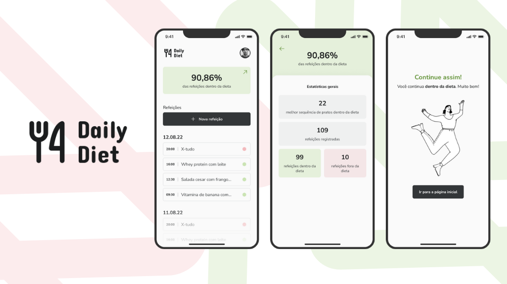
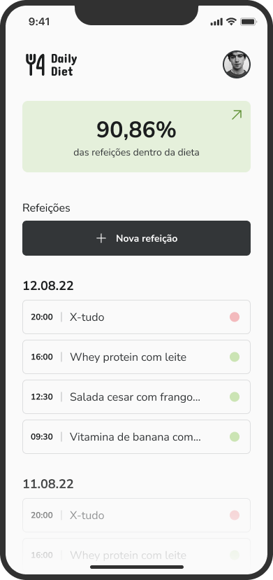
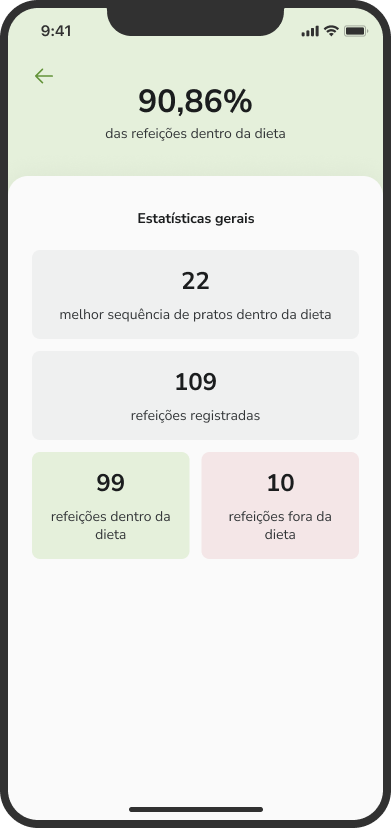
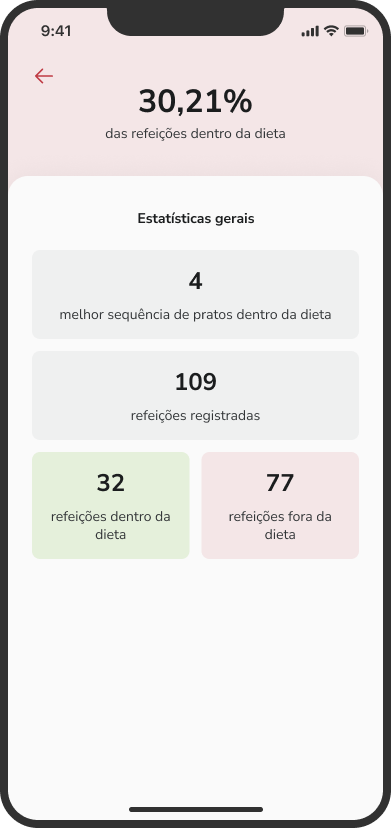
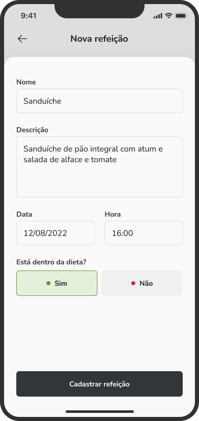
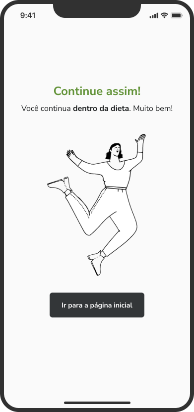
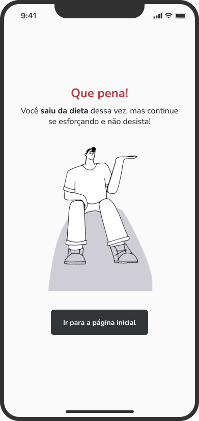
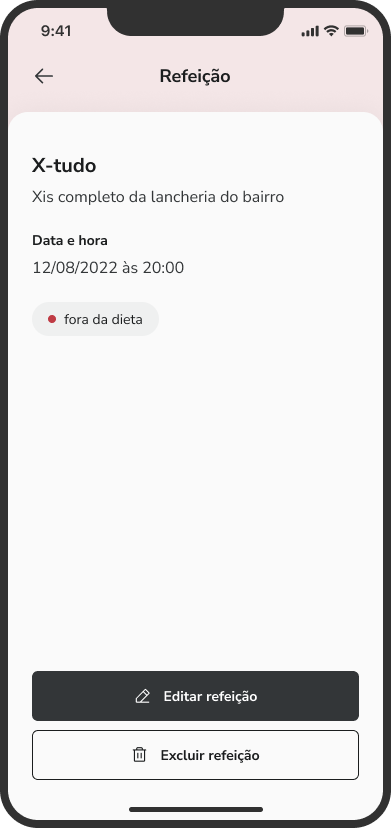
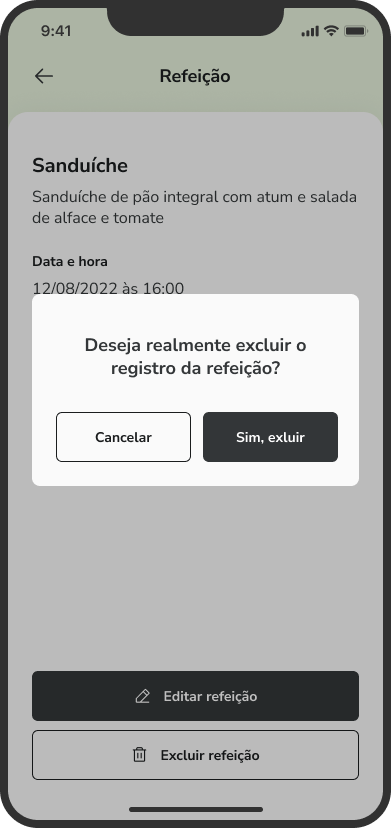

<p align="center">
  

  
  
  <a href="https://github.com/lucashs94/React_Native_-_iGames/commits/master">
    
  </a>
</p>
<br>

<h1 align="center">
    
</h1>

<h1 align="center"> 
	DailyDiet - Acompanhe suas refeiçoes com eficiência
</h1>
<br>

<p align="center">
 <a href="#-sobre-o-projeto">Sobre</a> •
 <a href="#-layout">Layout</a> • 
 <a href="#-funcionalidades">Funcionalidades</a> •
 <a href="#-como-executar-o-projeto">Como executar</a> • 
 <a href="#-tecnologias">Tecnologias</a> • 
 <a href="#-autor">Autor</a>
</p>
<br>

---

## 💻 Sobre o projeto

<br>

**Daily Diet** é um app para ajudar pessoas a controlarem o que elas comem durante o dia. Contabilizando cada refeição e gerando uma estatistica para que o usuario mantenha o hábito
<br>
<br>


---

## 🎨 Layout

O layout da aplicação está disponível no Figma:
<p>

  <a href="https://www.figma.com/file/fyJHZv3SZquo4BvELnxaZk/Daily-Diet?type=design&node-id=2%3A1297&mode=design&t=RykglT1jFbiESvgt-1">
    
  </a>
</p>
<br>


### Telas

<p align="center">
  
  
  
  
</p>

<p align="center">
  
  
  
  
</p>
<br>

---

## ⚙️ Funcionalidades

**TELA HOME**
  - [x] Tela principal, contendo:
    - [x] Card de estatistica
      - Ao clica no card, o usuário acessa a tela de estatisticas
    - [x] Botão para registrar nova refeição
    - [x] Listagem de cada refeição agrupado por dia
      - Ao clicar em cada refeição, o usuário acessa a tela de datlhes da refeição
<br>

**TELA DETAILS**
  - [x] Tela de datlhes da refeição, contendo:
    - [x] Detalhes e informações sobre a refeição criada
    - [x] Botão para editar a refeição
    - [x] Botão para excluir a refeição
<br>

**TELA ESTATISTICS**
  - [x] Tela de estatisticas, contendo:
    - [x] Informações calculadas com base nos registros de refeições
<br>

**TELA FEEDBACK**
  - [x] Tela de feedback ao usuário, contendo:
    - [x] Mensagem de feedback com base na informação do usuário sobre a refeição
<br>

**TELA DELETE**
  - [x] Tela de Exclusão, contendo:
    - [x] Modal de confirmação da exclusão da refeição

**TELA REGISTER**
  - [x] Tela de registro de refeição, contendo:
    - [x] Tela com os inputs para registrar uma nova refeição


<br>

---

## 🚀 Como executar o projeto

<p>
  💡 Este projeto utiliza o EXPO CLI como ferramenta de desenvolvimento, portanto é preciso ter o EXPO instalado na máquina. 
</p>


### Pré-requisitos

Antes de começar, você vai precisar ter instalado em sua máquina as seguintes ferramentas:
  - [Git](https://git-scm.com)
  - [Node.js](https://nodejs.org/en/) 
  - [VSCode](https://code.visualstudio.com/)

<br>

### 🎲 Rodando o Projeto

 
**Clone este repositório**

```bash
  
git clone https://github.com/lucashs94/React_Native_-_DailyDiet.git
  
```
 
**Acesse a pasta do projeto**

```bash
  
cd React_Native_-_DailyDiet
  
```
 
**Instale as dependências**

```bash
  
npm install
  
```
 
**Rode o projeto com Expo limpando o cache**

```bash
  
npx expo start --clear
  
```
<br>

---  

## ✨ Tecnologias

-   [X] React Native
-   [X] Typescript
-   [X] Styled Components
-   [X] Expo
-   [X] Async Storage
-   [X] Phosphor Icons
-   [X] Expo Google Fonts
-   [X] Expo Splash Screen
-   [X] React Navigation
-   [X] React Native Safe Area Context
-   [X] React Native UUID
-   [X] React Native DateTimePicker


> Veja o arquivo  [package.json](https://github.com/lucashs94/React_Native_-_DailyDiet/blob/main/package.json)
<br>

---

## 🦸 Autor

<a href="https://blog.rocketseat.com.br/author/thiago/">
 
 <br />
 <br />

[](https://www.linkedin.com/in/lucashs94/) <br>
[](mailto:h7.lucas@gmail.com)

